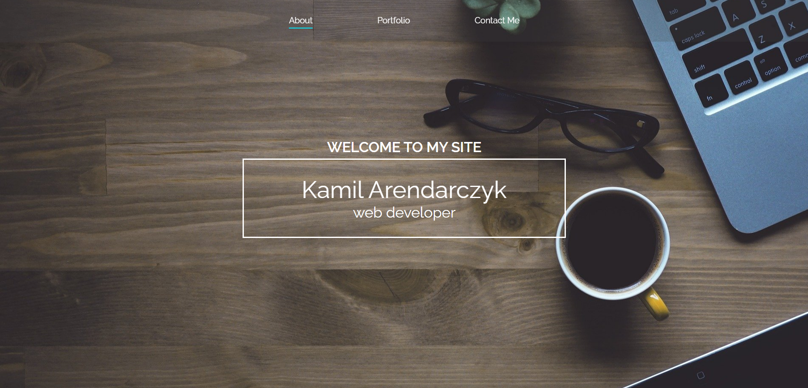
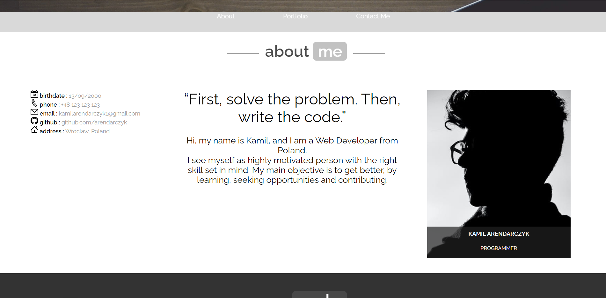
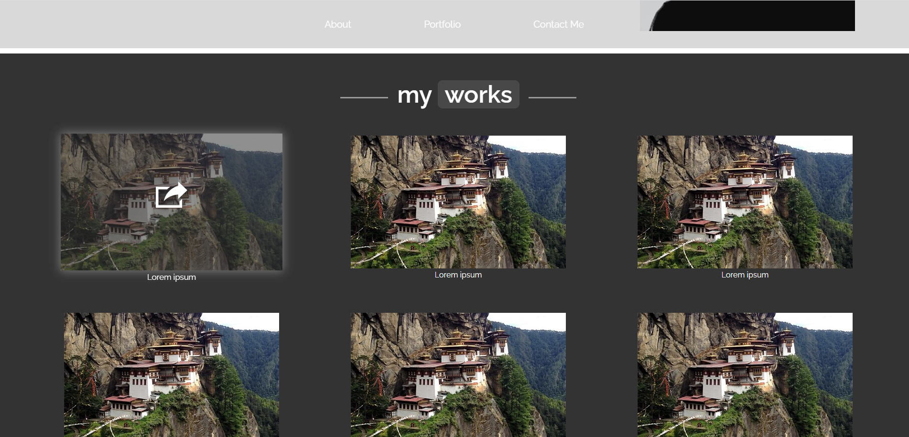
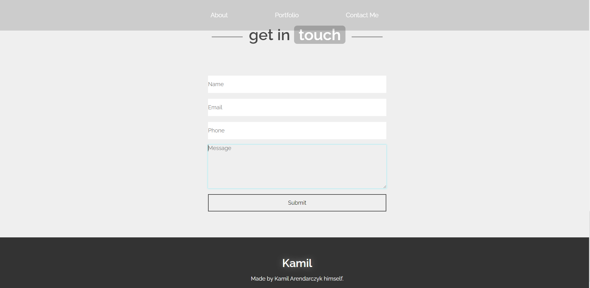

# Info

The website shows a simple portfolio made during the CodersCamp course, using only HTML and CSS(RWD, FlexBox, Grid).

[Page template](https://arendarczyk.github.io/CodersCamp2020.Project.HTML-CSS.BusinessCard/)

## Status
Project is: _finished_

# Page showcase

